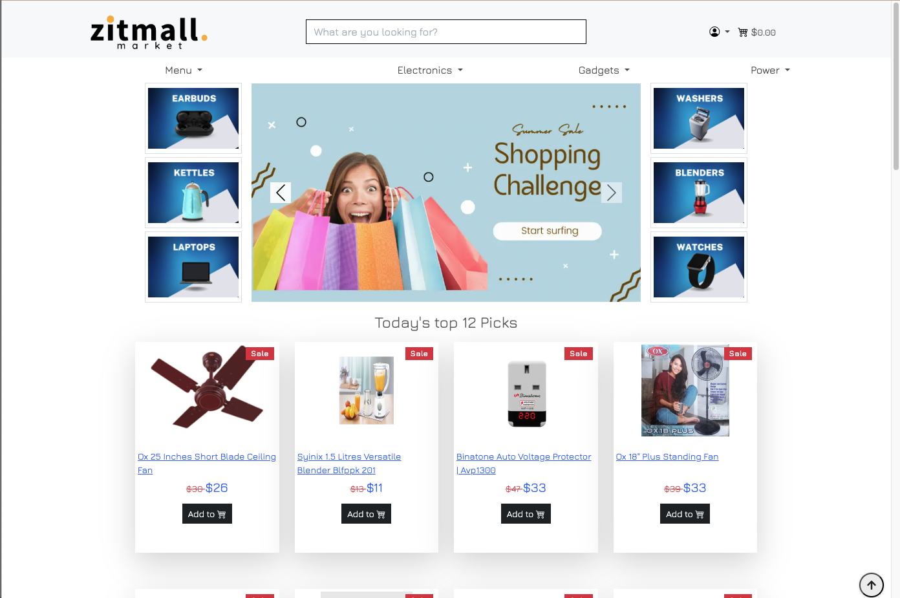
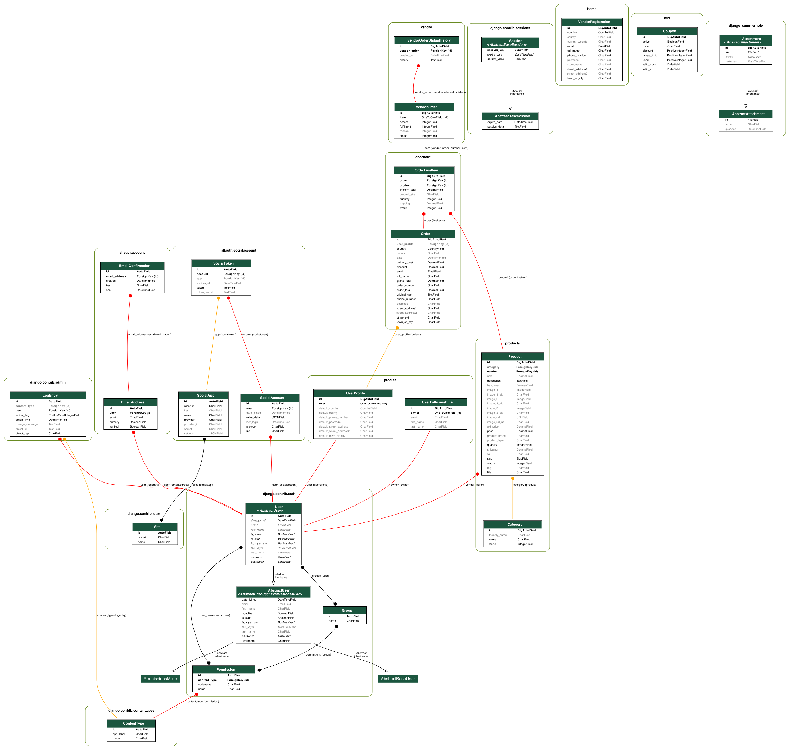
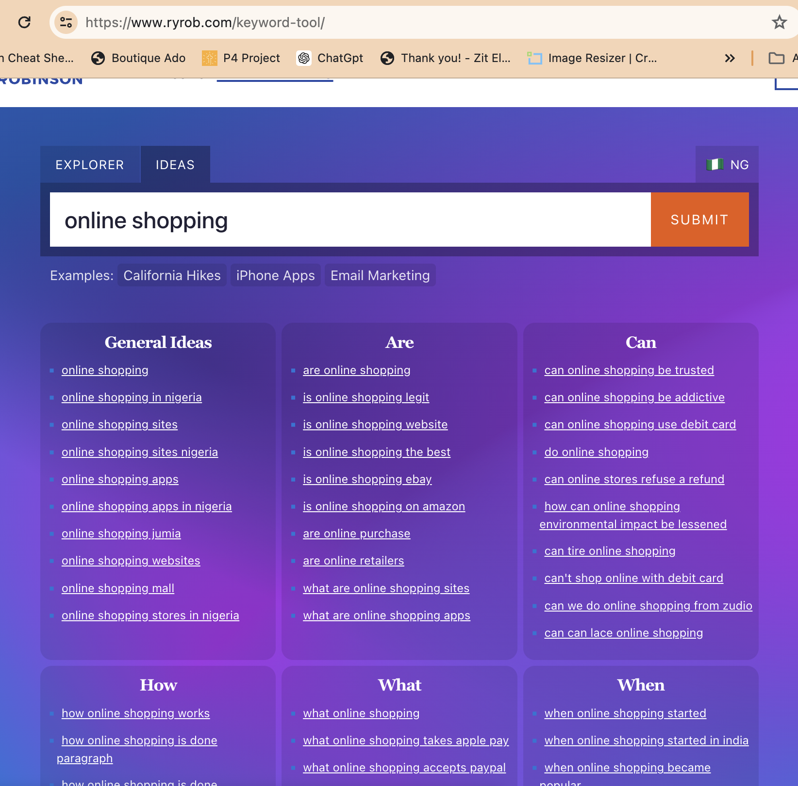
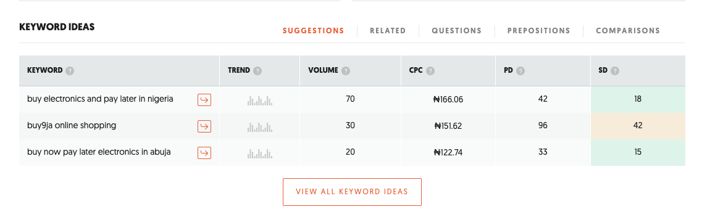
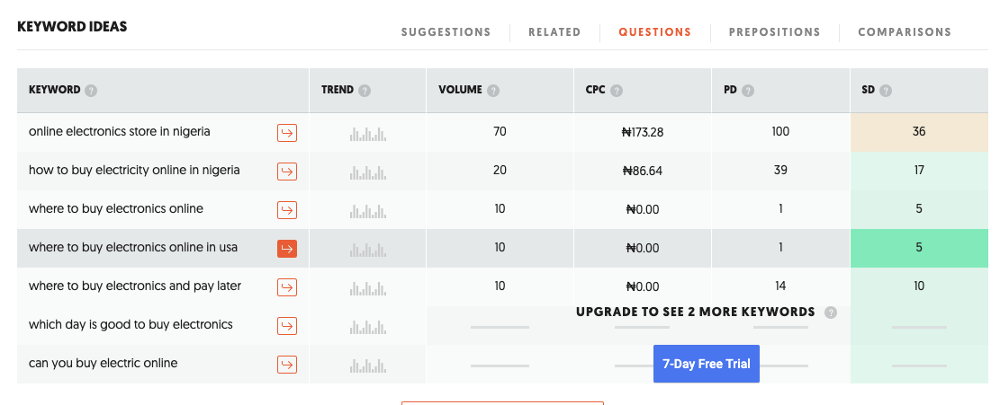
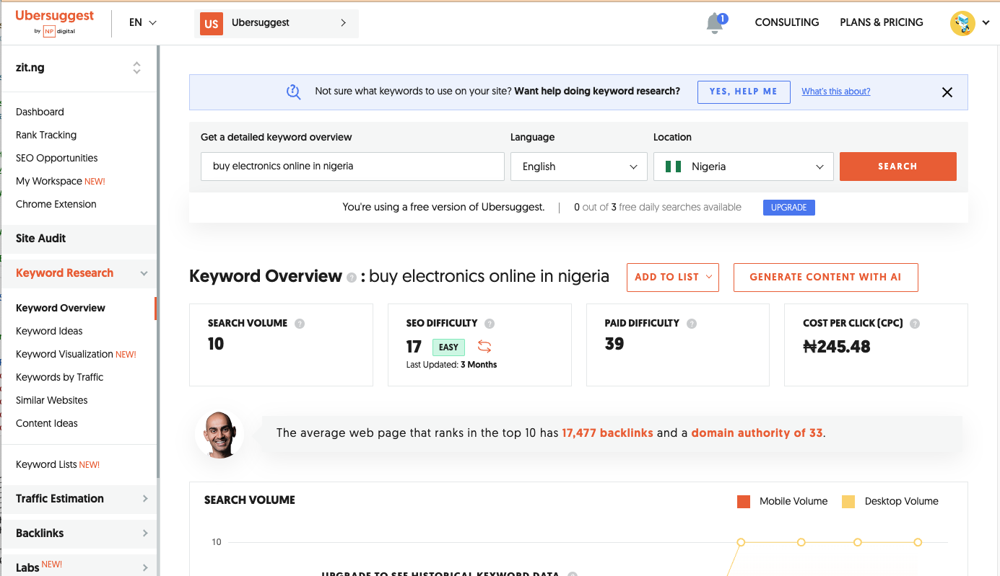

# 

## Welcome,
Zit: Your Premier Online Marketplace for House Appliances

Zit is an online marketplace specializing in house appliances. In addition to offering a beautifully crafted shopping site, Zit extends its platform to other sellers (vendors). This allows vendors to manage their products and orders efficiently through a robust vendor management area.
 

The link to the deployed site can be found [Here](https://zitmall-1f03b915b742.herokuapp.com/)

## User Stories

### Anonymous Guest User Goals: 
As an anonymous guest or registered user, I want to be able to:

 - [View store's products](https://github.com/dcsndevs/zitmall/issues/1)
 - [Assemble shopping cart](https://github.com/dcsndevs/zitmall/issues/2)
 - [View products when I search by text](https://github.com/dcsndevs/zitmall/issues/3)
 - [Use coupon codes](https://github.com/dcsndevs/zitmall/issues/4)
 - [view recommended products](https://github.com/dcsndevs/zitmall/issues/5)
 - [View the website's privacy policy](https://github.com/dcsndevs/zitmall/issues/6)

 - [Checkout](https://github.com/dcsndevs/zitmall/issues/12)
 - [Make payment online](https://github.com/dcsndevs/zitmall/issues/13)

### Vendor Goals: 
As a member, I want to be able to:

 - [Create and edit products](https://github.com/dcsndevs/zitmall/issues/10)
 - [Manage orders made on my products](https://github.com/dcsndevs/zitmall/issues/11)

### Admin/Owner Goals: 
As an admin, I want to be able to:

 - [Manage user account](https://github.com/dcsndevs/zitmall/issues/7)
 - [Manage products](https://github.com/dcsndevs/zitmall/issues/8)
 - [Manage orders](https://github.com/dcsndevs/zitmall/issues/9)

## Database Schema
# 

## Search Engine Optimisation
#### Step-by-Step Guide to Creating SEO for Zitmall
- Introduction
In this guide, I will explain the step-by-step process followed to create an SEO-friendly homepage for Zitmall, an online marketplace specializing in electronics and kitchen products in Nigeria. I will cover the implementation of long-tail and short-tail keywords, meta descriptions, and other SEO elements to enhance the website's visibility and ranking on search engines.

#### Step 1: Identify Relevant Keywords
First, I identified relevant long-tail and short-tail keywords that potential customers might use when searching for products offered by Zitmall. 
[Google](https://google.com) search and [Ryrob](https://www.ryrob.com/keyword-tool/) free research tool were used to determine popular keywords while [Neil Patel Ubbersuggests](https://neilpatel.com/ubersuggest/) app was used to choose the ones with high clicks but lower competition. The best keywords were observed to be short, (eg Television, electronics, appliances) high in competition and very often, were vague and directed users to sites that were not necessarily e-commerce sites

- #### Google search auto-generated keyword 
- #### Google search related keywords 
- #### Ryrob Keyword ideas 
- #### Ubbersuggest good keywords 
- #### Ubbersuggest accepted keywords 
- #### Ubbersuggest other industry competitors 

The keywords were categorized to cover various aspects of the business:

- Long-tail Keywords:
Buy electronics online in Nigeria
Online marketplace for electronics and kitchen
Best online shopping site for home appliances
Cheap smartphones and tablets online
Discounted laptops and computers for sale
Buy home entertainment systems online
Best deals on smart home devices
Top-rated online store for cameras and accessories
- Short-tail Keywords:
Online shopping
Electronics
Home appliances
Smartphones
Laptops
Kitchen appliances
Smart home devices
#### Step 2: Craft the Homepage Content
Using the identified keywords, I crafted a comprehensive and engaging homepage content for Zitmall. The content was designed to be informative, promotional, and keyword-rich to attract both search engines and users. Below is the content created:

#### Welcome to Zitmall - Your Premier Online Marketplace for Electronics and Kitchen in Nigeria

At Zitmall, we bring you an unparalleled online shopping experience in Nigeria. Our extensive collection of products spans various categories, ensuring that you find exactly what you need at the best prices. Whether you are looking to buy electronics online in Nigeria or find the latest kitchen trends, Zitmall is your go-to destination.

#### We are that store near you!

**Wide Range of Products:** From home appliances to the latest gadgets, we have everything you need. Explore our categories including AC Bracket, Air Conditioners, Blenders, Ceiling Fans, Chest Freezers, and much more.

**Affordable Prices:** Get the best deals on cheap smartphones and tablets online. Our discounted laptops and computers for sale are perfect for budget-conscious shoppers.

**Quality and Reliability:** We offer top-rated products such as Apple iPads, iPhones, and smartwatches. Trust us to provide high-quality home entertainment systems and sound systems for your home.

**Convenience:** Shop from the comfort of your home and enjoy fast delivery services. Find everything you need, from gas cookers and refrigerators to washing machines and water dispensers, all in one place.

#### Explore Our Categories:
- **Home Appliances:** Discover a wide selection of home appliances including Cookers, Electric Hotplates, Freezers, and Refrigerators.
- **Electronics:** Buy home entertainment systems online, including Smart TVs, DVD Players, and Home Theaters.
- **Generators:** Shop for the latest power equipment and generators.
- **Smart Phones:** Find the best deals on smart home devices such as Smartwatches and Mobile Phones.
- **Office Supplies:** Get essential office supplies like Laptops and Extension cords.
- **Kitchen Appliances:** Choose from a variety of kitchen appliances including Microwaves, Blenders, and Rice Cookers.

#### Special Offer:
As a welcome gesture, new customers can enjoy a 12% discount on their first purchase with a voucher you will receive when you subscribe to our newsletter. Start shopping now and experience the best of online shopping at Zitmall.

#### Join the Zitmall Community:
Stay updated with our latest offers and products by subscribing to our newsletter. Follow us on social media to never miss out on exciting deals and promotions.

#### Customer Support:
Our dedicated customer support team is here to assist you with any queries or issues. Shop with confidence knowing that we are committed to providing the best service.

#### Start Shopping Today!
Visit Zitmall.com and discover why we are the best online shopping site for home appliances, electronics, and kitchen appliances in Nigeria. Enjoy seamless shopping and incredible deals only at Zitmall.

#### Step 3: Add Meta Description
A meta description is a summary of the page content that appears in search engine results. It's crucial for improving click-through rates. Here is the meta description created for Zitmall:
- description-content="Zitmall is your premier online marketplace in Nigeria for electronics, kitchen appliances, and more. Enjoy the best deals on home entertainment systems, smartphones, laptops, and quality products delivered to your door. Start shopping today and get a 12% discount on your first purchase!"
#### Step 4: Add Meta Keywords
Meta keywords help search engines understand the main topics of your page. Here is the list of meta keywords created:
- Content: "buy electronics online in Nigeria, online marketplace for electronics, best online shopping site for home appliances, cheap smartphones and tablets online, discounted laptops and computers for sale, buy home entertainment systems online, best deals on smart home devices, top-rated online store for cameras and accessories, Zitmall"

#### Step 5: Add Brand Logos with Links
We added a section with logos of popular brands, each linked to their respective sites. This enhances the user experience and boosts SEO through outbound links.

#### Conclusion
By following these steps, we ensured that Zitmall's homepage is optimized for search engines and provides a great user experience. The use of relevant keywords, a compelling meta description, and structured content helps in attracting organic traffic and improving search engine rankings.

## Features 

## Cart and Checkout Features:
- View Cart:
Users can view the items they have added to their cart by navigating to the cart page. This page provides a summary of all items, quantities, and prices.

- Add to Cart:
Users can add items to their cart from product pages. This functionality is accessible via an "Add to Cart" button, which ensures a seamless shopping experience.

- Adjust Cart:
Users have the option to adjust the quantity of items in their cart. This can be done directly from the cart page, allowing users to increase or decrease item quantities as needed.

- Remove from Cart:
If users decide they no longer want an item, they can remove it from their cart. This feature helps users manage their purchases before proceeding to checkout.

- Quick Add to Cart:
The "Quick Add" feature allows users to add a single quantity of a specified product to their cart quickly. This is particularly useful for frequent buyers who want to expedite their shopping process.

- Apply Coupon:
Users can apply coupon codes during checkout to avail of discounts. This feature supports marketing strategies and encourages purchases by offering promotions.

- Empty Cart:
Users can choose to empty their entire cart, removing all items at once. This is useful for users who wish to start their shopping over.

## Checkout and Order Management:
- Checkout:
The checkout process is streamlined to ensure users can complete their purchases efficiently. It includes steps for entering shipping information, applying coupons, and selecting payment methods.
Use  Card number **4242 4242 4242 4242** on any future date and any CCV number to place test orders.

- Checkout Success:
Upon successful completion of a purchase, users are redirected to a checkout success page. This page displays order details and confirms the transaction.
[Checkout Success](https://zitmall-1f03b915b742.herokuapp.com/checkout/checkout_success/97IF270524)

- Cache Checkout Data:
To improve the user experience, checkout data is cached. This feature ensures that users do not lose their information in case of interruptions during the checkout process.

- Webhooks:
The site is integrated with webhooks to handle real-time updates from payment gateways and other external services, ensuring smooth transaction processing.
[Webhooks success](documentation/webhooks-success.png)

User and Vendor Management:
- Privacy Policy:
A dedicated privacy policy page informs users about data collection, usage, and protection practices, ensuring transparency and compliance with regulations.
[Privacy policy](https://zitmall-1f03b915b742.herokuapp.com/privacy-policy)

- Vendor Signup:
Aspiring vendors can register on the platform through the vendor signup page. Approved vendors gain access to a dashboard for managing their products and orders.
[Vendor Signup form](https://zitmall-1f03b915b742.herokuapp.com/vendor/signup)

- User Profiles:
Users can view and edit their profiles, including personal information, addresses, and order history, providing a personalized shopping experience.

- Password Change:
Users can change their passwords from their profile settings, ensuring account security.

## Product Management for Vendors:
**Sample login for vendor:**
Address: https://zitmall-1f03b915b742.herokuapp.com/accounts/login/
user:palmridges@yahoo.com 
Password: JjCaUMf*N.t33C#

Remember to create your products and order them using card -4242 4242 4242 4242

- Vendor Admin:
Vendors have access to an admin dashboard where they can manage their products, orders, and other relevant information.

- Add Product:
Vendors can add new products to their catalog through a user-friendly form. This feature includes fields for product details, pricing, images, and more.

- [All Products:](documentation/vendor-product-management.png)
Vendors can view a list of all their products, including those currently available and those that are out of stock or in draft status.

- Status Products:
Vendors can update the status of their products (e.g., draft, published) to control their visibility on the storefront.

- Edit Product:
Vendors can edit product details, allowing for updates to descriptions, prices, images, and other information.

- Delete Product:
If necessary, vendors can delete products from their catalog. This feature ensures vendors can keep their offerings current and relevant.

Order Management for Vendors:
- Vendor Orders:
Vendors can view all orders placed for their products, providing an overview of their sales.

- [New Vendor Orders](documentation/vendor-area-new-order):
A dedicated section for new orders helps vendors prioritize recent sales for prompt processing.

- Cancelled Vendor Orders:
Vendors can view orders that have been cancelled, allowing them to manage inventory and customer communication effectively.

- Delivered Vendor Orders:
Orders marked as delivered are tracked, helping vendors confirm successful transactions.

- Delivery Failed Vendor Orders:
In cases where delivery fails, vendors can view these orders to take necessary actions, such as reshipping or refunding.

- Active Vendor Orders:
Vendors can view and manage orders that are currently in process, ensuring timely fulfillment.

- Shipment Type:
Vendors can specify the type of shipment for each order, facilitating logistics and delivery management.

- Accept Order:
Vendors have the option to accept orders, confirming their ability to fulfill them.

- Reject Order:
If necessary, vendors can reject orders, providing reasons and managing customer expectations.

- Cancel Order:
Vendors can cancel orders, updating the status and notifying customers accordingly.

- Ship Order:
Once an order is ready for dispatch, vendors can mark it as shipped, triggering notifications and tracking.

- Deliver Order:
Upon successful delivery, vendors can mark orders as delivered, completing the transaction lifecycle.

- Delivery Failed Order:
For orders where delivery fails, vendors can update the status and take corrective actions.

- Print Order Receipt:
Vendors can print order receipts for record-keeping and customer service purposes.

## Additional Features:

## Newsletter: 
Users can sign up for newsletters directly from the home page. A Mailchimp form is embedded on the homepage, allowing users to input their email addresses. Upon successful submission, users receive a confirmation message, and their email addresses are added to the mailing list for future updates.

## Coupon Codes:
During checkout, users can apply coupon codes to avail discounts on their purchases. Admin has the authority to create, manage, and customize coupon codes for specific discounts, expiry dates, and usage limits. For instance, there's a "Welcome12" code offering a 15% discount, which is provided to new users who sign up for the newsletter subscription.

## Order History:
Vendors can access their order history through the vendor area portal. This feature provides a comprehensive list of all past orders, including order numbers, dates, statuses, and total amounts.
Vendors can view detailed information for each order, such as itemized lists of products, quantities, prices, and shipping details. This helps vendors keep track of their orders.
[Order history sample](documentation/order-history.png)

## Vendor Registration form Contact: 

Individuals interested in becoming vendors can register through the vendor signup page ([zit](https://zitmall-1f03b915b742.herokuapp.com/vendor/signup)). Upon submission, vendor registration requests are sent to the Admin for approval. Once approved, vendors are manually created by the Admin, granting them access to the vendor dashboard to manage their products and orders.

## New user creation:
An anonymous user can opt into creating a new account during checkout. If they check the button, a new account with an automatically created password would be created on their behalf and an email sent to that effect.

## Sendmail:
At the end of each new order, an email is sent to the user to notify them of their order and also of the details of their order. -
A new user creation email is also sent if an anonymous user placed an order and checked the button for new user creation

## Out of Stock:
This feature prevents users from ordering an item that is zero in quantity. An example of such a product is the [Saisho burner](https://zitmall-1f03b915b742.herokuapp.com/products/kitchen-appliances-cookers-hotplates-saisho-hp-11-coil-electric-hot-plate-single-steel). The product has a view configuration that prevents users from ordering it and also has different warning preventive methods on the front end. When a product quantity falls below 5, the user sees a notification beneath the product title. When the product equals zero, the add to cart button on the product list view disappears and the add to cart button on the product detail page becomes disabled. All these are relevant feedback that promotes positive user experience.

## Testing & Formatting
Rigorous manual testing was performed to ensure the app's functionality, including user inputs, menu navigation, and responsiveness across screens.

### JSHint
All JavaScript files have been formatted using [jShint](https://jshint.com/) where notable errors about lines not ending properly with a semicolon. All the issues were promptly addressed. However, there were warnings regarding:
 -1- 	'template literal syntax' is only available in ES6 (use 'esversion: 6'). especially on the stripe.js file. These warnings were ignored as they did not pose a threat to our code
 -2- ["Undefined variables"](documentation/jshint-undefined-variables) These were variables that were not present in the same file but were already referenced in the corresponding HTML django template files. I therefore ignored these warnings as there was nothing wrong with the concept of having the variables in the host HTML files.

### Google PageSpeed Insights:
[PageSpeed Insights](https://pagespeed.web.dev/) was used to check for the Speed, performance, SEO, and Accessibility of the pages. 
Google PageSpeed insights was used to test the speed of the website and various issues were highlighted which was followed by subsequent adjustments.
A notable issue raised was about having too many scripts being loaded before the first image and test were loaded. I fixed that by making sure that javascript files are taken to the bottom of the page. I also reduced the size of my hero image and converted it to Webp format.
- 
- [Index page mobile](documentation/pageinsight-index-mobile)
- [Index page mobile](documentation/pageinsight-index-mobile)
- [Product page desktop](documentation/products-page-desktop.png)
- [Products page mobile](documentation/products-page-mobile.png)
- [Privacy Policy Mobile](documentation/pg-privacy-policy-mobile.png)
- [Privacy Policy Desktop](documentation/pageinsight-privacy-policy-desktop.png)
- [Product detail page](documentation/pg-product-detail-desktop.png)
- [Vendor Signup page](documentation/pg-vendor-signup-desktop.png)
- [Vendor signup page mobile](documentation/pg-vendor-signup-mobile.png)

### W3 Validator:
[W3 Validator](https://validator.w3.org/) was used to check for errors on the HTML pages. All highlighted errors were eliminated by correcting the codes, removing extra tags where necessary, adding aria attributes where missing, adding "href" or button as a role where necessary and generally following standard naming conventions/practice. 
- [Home page validator screenshot](documentation/w3-validator-index-page)

The W3 validator was used to check errors and all found errors were correct. There were however warnings concerning text with the "article" elements on the devotional pages and programmes page. The warning advised on the use of headings (h2-h6) to write the articles.

### CI Python Linter:
All Python file was fully formatted with [Pep8Ci](https://pep8ci.herokuapp.com/) and all errors have been corrected, with the main errors being lines extending over 79 characters. However, there we errors regarding long lines exceeding 79 characters on the [settings file](documentation/settings-pep8-error) which were ignored. I ignored them because they were system files, many of which were auto-generated. They do not pose a threat to the workings of our code.

### Manual Testing: 
| Page                         | User Actions                                        | Expected Results                                         | Y/N | Comments    |
|------------------------------|-----------------------------------------------------|----------------------------------------------------------|-----|-------------|
| Home Page                    |                                                     |                                                          |     |             |
|                             | View home page                                      | Home page is displayed                                   | Y   |             |
| Newsletter Signup            |                                                     |                                                          |     |             |
|                             | Enter valid email and submit                        | Success message and email added to mailing list          | Y   |             |
| View Cart                    |                                                     |                                                          |     |             |
|                             | View items in cart                                  | Cart page displays all items                             | Y   |             |
| Add to Cart                  |                                                     |                                                          |     |             |
|                             | Click on Add to Cart button on product page         | Product is added to the cart                             | Y   |             |
| Adjust Cart                  |                                                     |                                                          |     |             |
|                             | Change item quantity in cart                        | Item quantity is updated                                 | Y   |             |
| Remove from Cart             |                                                     |                                                          |     |             |
|                             | Click Remove button in cart                         | Item is removed from the cart                            | Y   |             |
| Apply Coupon                 |                                                     |                                                          |     |             |
|                             | Enter coupon code at checkout                       | Discount is applied to the total                         | Y   |             |
| Quick Add to Cart            |                                                     |                                                          |     |             |
|                             | Use quick add button on product page                | Single quantity of product added to the cart             | Y   |             |
| Empty Cart                   |                                                     |                                                          |     |             |
|                             | Click Empty Cart button                             | All items are removed from the cart                      | Y   |             |
| Checkout                     |                                                     |                                                          |     |             |
|                             | Complete checkout process                           | Order is successfully placed                             | Y   |             |
| Checkout Success             |                                                     |                                                          |     |             |
|                             | View checkout success page                          | Order confirmation details are displayed                 | Y   |             |
| Cache Checkout Data          |                                                     |                                                          |     |             |
|                             | Proceed with interrupted checkout                   | Cached data pre-fills the checkout form                  | Y   |             |
| Webhook                      |                                                     |                                                          |     |             |
|                             | Payment confirmation from gateway                   | Order status updated in real-time                        | Y   |             |
| Privacy Policy               |                                                     |                                                          |     |             |
|                             | View privacy policy                                 | Privacy policy content is displayed                      | Y   |             |
| Vendor Signup                |                                                     |                                                          |     |             |
|                             | Complete vendor registration form                   | Vendor registration request is submitted                 | Y   |             |
| All Products                 |                                                     |                                                          |     |             |
|                             | View all products                                   | Product list is displayed                                | Y   |             |
| Product Detail               |                                                     |                                                          |     |             |
|                             | View product details                                | Product details page is displayed                        | Y   |             |
| Profile View                 |                                                     |                                                          |     |             |
|                             | View user profile                                   | User profile details are displayed                       | Y   |             |
| Change Password              |                                                     |                                                          |     |             |
|                             | Change account password                             | Password is successfully updated                         | Y   |             |
| Profile Address              |                                                     |                                                          |     |             |
|                             | View and edit profile address                       | Address details are displayed and can be edited          | Y   |             |
| Persona                      |                                                     |                                                          |     |             |
|                             | Access persona settings                             | Persona settings page is displayed                       | Y   |             |
| Order History                |                                                     |                                                          |     |             |
|                             | View past orders                                    | Order history is displayed                               | Y   |             |
| Vendor Admin                 |                                                     |                                                          |     |             |
|                             | Access vendor admin dashboard                       | Vendor dashboard is displayed                            | Y   |             |
| Add Product                  |                                                     |                                                          |     |             |
|                             | Add a new product                                   | Product is successfully added                            | Y   |             |
| Edit Product                 |                                                     |                                                          |     |             |
|                             | Edit existing product details                       | Product details are updated                              | Y   |             |
| Delete Product               |                                                     |                                                          |     |             |
|                             | Delete a product                                    | Product is successfully deleted                          | Y   |             |
| Vendor Orders                |                                                     |                                                          |     |             |
|                             | View all vendor orders                              | List of vendor orders is displayed                       | Y   |             |
| New Vendor Orders            |                                                     |                                                          |     |             |
|                             | View new orders                                     | List of new orders is displayed                          | Y   |             |
| Cancelled Vendor Orders      |                                                     |                                                          |     |             |
|                             | View cancelled orders                               | List of cancelled orders is displayed                    | Y   |             |
| Delivered Vendor Orders      |                                                     |                                                          |     |             |
|                             | View delivered orders                               | List of delivered orders is displayed                    | Y   |             |
| Delivery Failed Vendor Orders|                                                     |                                                          |     |             |
|                             | View delivery failed orders                         | List of delivery failed orders is displayed              | Y   |             |
| Active Vendor Orders         |                                                     |                                                          |     |             |
|                             | View active orders                                  | List of active orders is displayed                       | Y   |             |
| Shipment Type                |                                                     |                                                          |     |             |
|                             | Specify shipment type                               | Shipment type is updated                                 | Y   |             |
| Accept Order                 |                                                     |                                                          |     |             |
|                             | Accept an order                                     | Order is marked as accepted                              | Y   |             |
| Reject Order                 |                                                     |                                                          |     |             |
|                             | Reject an order                                     | Order is marked as rejected                              | Y   |             |
| Cancel Order                 |                                                     |                                                          |     |             |
|                             | Cancel an order                                     | Order is marked as cancelled                             | Y   |             |
| Ship Order                   |                                                     |                                                          |     |             |
|                             | Mark order as shipped                               | Order is marked as shipped                               | Y   |             |
| Deliver Order                |                                                     |                                                          |     |             |
|                             | Mark order as delivered                             | Order is marked as delivered                             | Y   |             |
| Delivery Failed Order        |                                                     |                                                          |     |             |
|                             | Mark order as delivery failed                       | Order is marked as delivery failed                       | Y   |             |
| Print Order Receipt          |                                                     |                                                          |     |             |
|                             | Print order receipt                                 | Order receipt is printed                                 | Y   |             |

### Browser Testing:
The final project was tested on four different browsers, namely:
-Microsoft Internet explorer
-Google Chrome
-Brave
-Mozilla
The output was similar on all these browsers except on firefox, where the fonts appeared darker and were therefore better viewed in terms of clarity and contrast. 

## Bugs:
| Issue|Solution |
|-|-|
|Horizontal scroll bar appearing on all pages|I set overflow-x as hidden on my body element in CSS|

## Technologies used:
- [Django](https://docs.djangoproject.com/) is the web framework that was used to manage this project.
- [Bootstrap5](https://getbootstrap.com/) is the web framework used for custom components and layouts.
- [Python](https://python.org) is the main technology used in this application
- [Graphviz](https://graphviz.org/) was used to export the database schema into png image.
- [VScode](https://vscode.com/) was used to write and edit the codes and host the site on my local  computer
- [Git](https://github.com) was used for the version control of the application
- [Heroku](https://heroku.com) was used to host the deployed application
- [ChatGPT](https://chat.openai.com/) was often consulted regarding the usage and construction of codes
- [Google Chrome](https://chrome.google.com/) Developer tool was often used to check issues arising from codes, responsiveness, and general testing.
- [Code Institute Python Linter](https://pep8ci.herokuapp.com/) was used to check code for any issues
- [Python Formatter](https://formatter.org/python-formatter) was used to check code for any issues

### Languages Used

* [HTML5](https://en.wikipedia.org/wiki/HTML5)
* [CSS3](https://en.wikipedia.org/wiki/CSS)
* [JavaScript](https://en.wikipedia.org/wiki/JavaScript)
* [JQuery](https://jquery.com/)
* [Python](https://en.wikipedia.org/wiki/Python_(programming_language))

## Deployment

The Heroku git URl is https://git.heroku.com/devotional.git

The app was then deployed on Heroku via Github:

1. Heroku Account Setup:

    Log in to your existing Heroku account or create a new account.

2. Create a New App:

    On the Heroku dashboard, click "New" and select "Create new app."

3. Configure Your App:

    Choose a unique app name and select your preferred region.
    Click "Create app" to initiate the app creation process.

4. Environment Configuration:

    In the app dashboard, find the "Settings" tab and locate "Config Vars."
    Click "Reveal Config Vars" and add a new variable with the key "PORT" and the value "8000." Click "Add" to save.

5. Set Up Buildpacks:

    Scroll down to the "Buildpack" section in the settings.
    Click "Add," select "Python," and add it. Ensure that "Python" is listed first.
    Repeat the process, this time adding "Node.js" as a build pack.

6. Deploy Your App:

    Navigate to the "Deploy" tab at the top of the dashboard.
    Choose GitHub as your deployment method and link your repository to the app.

7. Automatic or Manual Deployment:

    Scroll down to the deployment section.
    Choose either "Enable Automatic Deploys" for continuous integration or "Manual Deploy" for manual control.

Deployed site -> [Here](https://zitmall-1f03b915b742.herokuapp.com/)

### Local Deployment:
To clone this project, you can do so using VsCode or any code editor that has an integrated development Environment (IDE), using this command: 

1. Clone the repository: `git clone https://github.com/your-username/zitmall.git`
2. Install dependencies: `pip install -r requirements.txt`

## Requirements and Dependencies

- [Requirements](https://github.com/dcsndevs/zitmall/blob/main/requirements.txt)

### ElephantSQL Database

1. Click Create New Instance to start a new database.
2. Provide a name (this is commonly the name of the project: tribe).
3. Select the Tiny Turtle (Free) plan.
4. You can leave the Tags blank.
5. Select the Region and Data Center closest to you.
6. Once created, click on the new database name, where you can view the database URL and Password.

### Cloudinary

1. For Primary interest, you can choose Programmable Media for image and video API.
2. Optional: edit your assigned cloud name to something more memorable.
3. On your Cloudinary Dashboard, you can copy your API Environment Variable.
4. Be sure to remove the CLOUDINARY_URL= as part of the API value; this is the key.

### Heroku Deployment
* Log into [Heroku](https://www.heroku.com/) account or create an account.
* Click the "New" button at the top right corner and select "Create New App".
* Enter a unique application name
* Select your region
* Click "Create App"

#### Prepare enviroment and settings.py
* In your GitPod workspace, create an env.py file in the main directory.
* Add the DATABASE_URL value and your chosen SECRET_KEY value to the env.py file.
* Update the settings.py file to import the env.py file and add the SECRETKEY and DATABASE_URL file paths.
* Comment out the default database configuration.
* Save all files and make migrations.
* Add the AWS URL to env.py
* Add the BotoStorage libraries to the list of installed apps.
* Add the STATIC files settings - the url, storage path, directory path, root path, media url and default file storage path.
* Link the file to the templates directory in Heroku.
* Change the templates directory to TEMPLATES_DIR
* Add Heroku to the ALLOWED_HOSTS list the format ['app_name.heroku.com', 'localhost']

#### Add the following Config Vars in Heroku:

* SECRET_KEY - This can be any Django random secret key
* AWS_ACCESS_KEY_ID - Insert your own AWS_ACCESS_KEY_ID
* AWS_SECRET_ACCESS_KEY - Insert your own AWS_SECRET_ACCESS_KEY
* STRIPE_PUBLIC_KEY - Insert your own STRIPE_PUBLIC_KEY
* STRIPE_SECRET_KEY - Insert your own STRIPE_SECRET_KEY
* STRIPE_WH_SECRET - Insert your own STRIPE_WH_SECRET
* EMAIL_HOST_USER - Insert your own EMAIL_HOST_USER
* EMAIL_HOST_PASS - Insert your own EMAIL_HOST_PASS
* PORT = 8000
* DISABLE_COLLECTSTATIC = 1 - this is temporary and can be removed for the final deployment
* DATABASE_URL - Insert your own ElephantSQL database URL here

#### Heroku needs two additional files to deploy properly

* requirements.txt
* Procfile

#### Deploy

1. Make sure DEBUG = False in the settings.py
2. Go to the deploy tab on Heroku and connect to GitHub, then to the required repository.
3. Scroll to the bottom of the deploy page and either click Enable Automatic Deploys for automatic deploys or Deploy Branch to deploy manually. Manually deployed branches will need re-deploying each time the GitHub repository is updated.
4. Click 'Open App' to view the deployed live site.

### Docs

* [Code Institute](https://learn.codeinstitute.net/dashboard)
* [Bootstrap 5.3](https://getbootstrap.com/docs/5.3/getting-started/introduction/)
* [Django docs](https://docs.djangoproject.com/en/4.2/releases/3.2/)
* [Django Allauth](https://django-allauth.readthedocs.io/en/latest/)
* [Django and Static Assets](https://devcenter.heroku.com/articles/django-assets)
* [Cloudinary](https://cloudinary.com/documentation/diagnosing_error_codes_tutorial)
* [Google](https://www.google.com/)

## Zitmall Business Model Summary
Zitmall operates as a comprehensive online marketplace specializing in electronics and kitchen products. The platform employs a dual business model, functioning both as a direct retailer and a marketplace for third-party vendors.

- Direct Sales: Zitmall sources and sells a wide range of electronics and kitchen products directly to consumers. This allows Zitmall to control product quality, pricing, and inventory, ensuring a seamless shopping experience.

- Marketplace for Vendors: In addition to its inventory, Zitmall provides a platform for external vendors to list and sell their products. This expands the product variety available to consumers and allows vendors to reach a larger audience.

- Commission-Based Revenue: For every successful sale made by third-party vendors, Zitmall collects a commission ranging from 5% to 10%. This commission-based model incentivizes vendors to maintain high sales volumes while generating steady revenue for Zitmall.

- Marketing: The main marketing channel is Google Ads, which attracts more intent-driven customers. Additionally, Zitmall plans to leverage Facebook for its cost-effectiveness, along with email subscriptions and newsletters, Instagram videos, WhatsApp status updates, and articles/blogging to reach a wider audience and engage customers.

Through this hybrid model, Zitmall aims to offer a diverse product selection, competitive prices, and a reliable shopping experience, while fostering a thriving ecosystem for vendors.

## Facebook Marketing Strategy for Zitmall
### Introduction
This is a comprehensive outline of Facebook marketing strategy for Zitmall, aimed at increasing brand awareness, driving traffic to the website, and boosting sales. Facebook is a powerful platform with a large user base, making it an ideal channel for promoting Zitmall's wide range of electronics and kitchen products.

Objectives
Increase Brand Awareness: Enhance Zitmall's presence on Facebook and establish it as a trusted online marketplace in Nigeria.
Drive Traffic to Website: Utilize Facebook to direct potential customers to Zitmall's website.
Boost Sales: Increase conversions by promoting products and special offers.
Engage with Customers: Build a community around the brand by engaging with followers and providing excellent customer service.
Target Audience
Demographics:

Age: 18-60
Gender: All
Location: Nigeria and the world
Interests: Electronics, Home Appliances, Kitchen Gadgets, Online Shopping
Psychographics:

Tech-savvy individuals
Budget-conscious shoppers
Homeowners looking to upgrade appliances
Individuals interested in the latest gadgets
Content Strategy
Content Types:

- Product Posts: Highlight different product categories with high-quality images and videos.
- Promotional Posts: Share special offers, discounts, and sales events.
- Educational Posts: Provide tips and guides on using products, maintenance, and buying guides.
- Customer Testimonials: Showcase reviews and testimonials from satisfied customers.
- Behind-the-Scenes: Share insights into the company, such as employee stories or company values.
Content Calendar:

- Daily Posts: Schedule one post per day to maintain a consistent presence.
- Weekly Features:
- Monday: New arrivals or featured products.
- Wednesday: Educational content or tips.
- Friday: Special offers or promotions for the weekend.
- Sunday: Customer testimonials or behind-the-scenes content.

## Ad Strategy

### Ad Formats:

- Carousel Ads: Showcase multiple products in a single ad.
- Video Ads: Highlight product features and usage.
- Collection Ads: Provide a seamless shopping experience directly from the ad.
- Dynamic Ads: Retarget users who have visited the website or shown interest in specific products.
Ad Targeting:

Custom Audiences: Target existing customers, website visitors, and email subscribers.
Lookalike Audiences: Reach new potential customers who resemble existing customer profiles.
Interest-Based Targeting: Target users based on their interests in electronics, home appliances, and online shopping.
Budget Allocation:

- Daily Budget: Allocate a daily budget for consistent ad presence.
Campaign Budget Optimization: Use Facebook's CBO feature to distribute budget across the best-performing ads.

### Ad Schedule:

- Always-On Campaigns: Run continuous campaigns for brand awareness and retargeting.
- Seasonal Campaigns: Increase budget and frequency during peak shopping seasons like Black Friday, Christmas, and New Year.
Engagement Strategy
- Respond to Comments and Messages: Ensure prompt responses to customer inquiries and comments on posts to build trust and engagement.
Host Contests and Giveaways: Encourage user participation by hosting regular contests and giveaways with attractive prizes.
- User-Generated Content: Encourage customers to share their experiences with Zitmall products and feature their posts on the company's Facebook page.
- Live Streaming: Host live product demonstrations, Q&A sessions, and special events to engage with followers in real time.
Analytics and Optimization
- Monitor Performance: Use Facebook Insights to track the performance of posts and ads.
A/B Testing: Continuously test different ad creatives, copy, and targeting options to identify what works best.
Adjust Strategy: Based on analytics, adjust the content and ad strategy to improve engagement and ROI.
Monthly Reports: Create monthly reports to evaluate the success of the campaigns and make data-driven decisions.

#### Conclusion
By implementing this Facebook marketing strategy, Zitmall aims to enhance its online presence, drive more traffic to its website, and increase sales. Consistent engagement, targeted advertising, and continuous optimization will help Zitmall achieve its marketing objectives and establish itself as a leading online marketplace in Nigeria.

## Project assessment criteria CHECKLIST for Portfolio 5: Project Submission

| Requirement    | Done           |  Comments    |
|-------------|------------------------|------------------|
| at least 3 original custom models with associated functionalities, markedly different from those present in the Boutique Ado walkthrough project if they have been used as a basis for your project.     |          Y              |   Coupon, Vendor Order, Vendor Order History, Vendor Registration, UserFullnameEmail. Product, Order, User Profile, and OderLineItem were re-modified |
| at least one form on the front end, which provides either admin or regular users with CRUD functionality without having to access the admin panel. |           Y            | Product management in Vendor area; Add product feature |
| at least one UI element on the front end, which allows either admin or regular users to delete records in the database without having to access the admin panel. |          Y            |    Vendors can permanently delete products from their dashboard | 
| evidence of agile methodologies followed during the development of your project in the GitHub repository. |  Y   |     See user stories and issues [links](https://github.com/users/dcsndevs/projects/4)           |
| a robots.txt file. |  Y   |     |
| a sitemap.xml file. |   Y  |     |
| descriptive meta tags in the HTML. |   Y  |     |
| at least one link to an external resource, which makes use of a rel attribute.  |  Y  |     |
| a custom 404 error page. |  Y  |     |
| evidence of either a real Facebook business page, or mockup of one, for the purposes of digital marketing. |  Y  |  [Facebook](documentation/facebook.png), facebook.com/zitmall |
| evidence of a newsletter signup form for the purposes of digital marketing. |  Y  |  [Welcome newsletter](https://mailchi.mp/07e10af79489/welcome-to-zit-mall-enjoy-12-off-your-first-purchase)  |
| a description of the e-commerce business model including marketing strategies in the README file. | Y  |     |
| DEBUG mode set to False. | Y  |    |
| working functionality for users to register and log in and out of the application without issues. | Y  |     |
| working E-commerce functionality for users to make purchases within the application. | Y  |     |
| detailed testing write ups, beyond results of validation tools. | Y  |     |

## Future Development and Limitations
- Work on a feature that does the commission calculations and thus helps vendors see how much goes to Zit and what's left.
- Work on a feature that helps vendors see how much has been made on the platform
- The search bar seldom did not return the expected query when full product titles were inputted. A more sophisticated query search would be created and added.

## Credits

### Code Institute:
Special thanks to the team at [Code Institute](https://codeinstitute.net) and [Tim Nelson](https://github.com/TravelTimN) for creating the Boutique Ado walk-through project. That walkthrough project is the backbone for the development of this Zitmall project. The stripe integration was adopted without changes. The design, ideas and structure were instrumental in shaping this final project. I remain grateful.

### Code Reference:

[OpenAi](https://chat.openai.com/) was instrumental to the success of this project. It was often used to learn quick features or to compare and see where errors are.

### Images:

All the product images used in the creation of this website were sourced from zit.ng website. Zit is an authorized distributor of these products.
1. The hero images were designed on Canva  and no references were provided for the pictures

### Acknowledgments:
I like to thank [Juliia Konn](https://github.com/IuliiaKonovalova/), my mentor at Code Institute. She exemplifies her mentorship with a knack for high-quality projects. Her desire for quality has always challenged me to do better in my work. I remain grateful to her.

I also like to thank my loving wife for her continuous support. She's a source of strength as always.